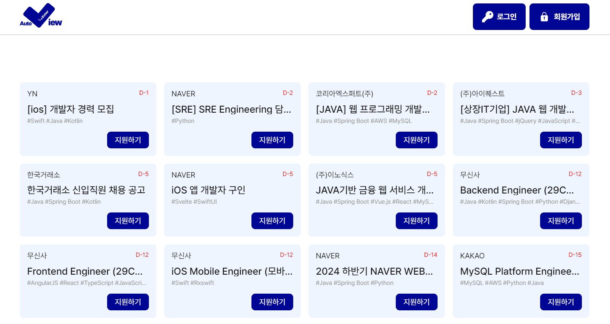
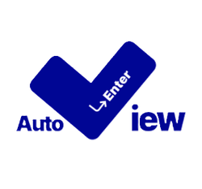
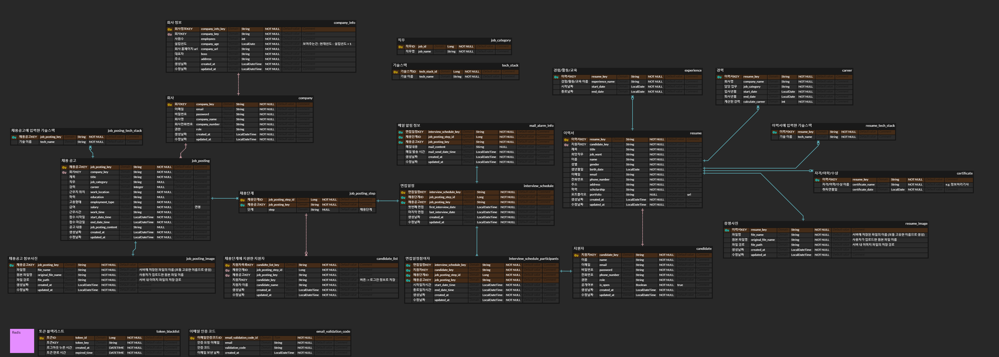
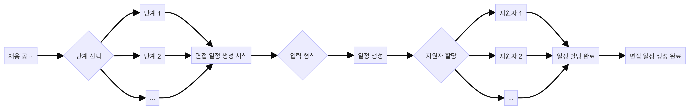
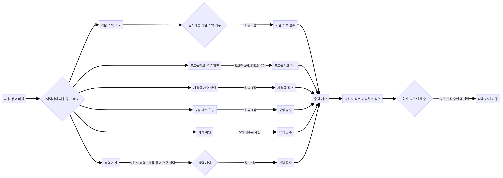
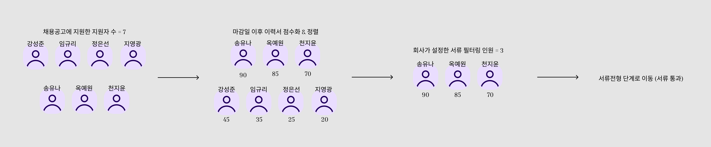
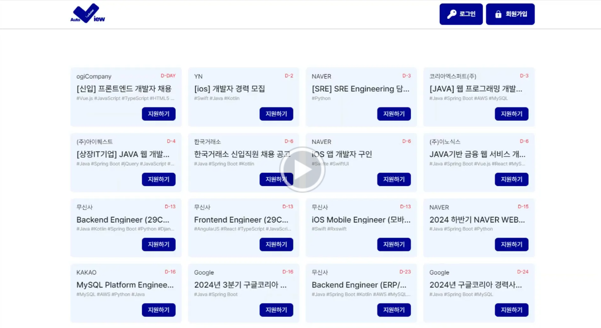

 
 

<h1> 💡 Auto Enter View </h1>

채용 과정의 자동화, Auto Enter View와 함께해보세요.  
서류 심사부터 면접 일정 관리까지 자동으로 해결하고, 채용의 전 과정을 간편하게 만들어 드립니다.

 

 
 

## 🗓️ Schedule
프로젝트 전체 진행 기간 : 2024.06.24 ~ 2024.07.31

 

## 🔗 Project Links

#### 🚀 [Auto Enter View](https://auto-enterview-fe.vercel.app/) : 서비스 배포

#### 🧾 [Auto Enter View](https://gray-heather-95a.notion.site/AutoEnterView-bad9c322c8104fc8bd86f4f86c6c7291) : Notion

#### 🖥️ [Database Schema](https://www.erdcloud.com/d/kMYDqc92D3iuqZGgL) : ERD (Entity Relationship Diagram)

#### 👻 [Frontend Repository](https://github.com/cheonjiyun/auto-enterview-fe) : Frontend GitHub

 
 

## 🧑‍🤝‍🧑 Backend Members

<table style="width: 100%; margin-left: auto; margin-right: auto;">
  <tr>
    <td>
        
    </td>
    <td>
        
    </td>
    <td>
        
    </td>
    <td>
        
    </td>
  </tr>

  <tr>
    <th>강성준</th>
    <th>임규리</th>
    <th>정은선</th>
    <th>지영광</th>
  </tr>

  <tr>
    <th>BE</th>
    <th>BE</th>
    <th>👑 BE</th>
    <th>BE</th>
  </tr>
</table>

 
 

## 📝 프로젝트 기능 및 설계

### 1.공통 기능

| 기능 | 세부 사항 |
|------|-----------|
| 👤 **회원 관리** | • 회원 유형 선택 (회사/지원자) • 이메일 중복 확인 • 이메일 인증 • 비밀번호 입력 (눈 아이콘으로 확인 가능) • 로그인/로그아웃 • 회원 정보 수정 및 삭제 |
| 🔒 **보안** | • 로그아웃 시 토큰 블랙리스트 관리 |

### 2. 회사 기능

| 기능 | 세부 사항 |
|------|-----------|
| 📊 **회사 정보 관리** | • 정보 등록 (사원 수, 설립 년도, 홈페이지 URL, 설명, 대표자, 주소) • 정보 수정 및 삭제 |
| 📢 **채용공고 관리** | • 공고 등록, 수정, 삭제 • 채용 기간 설정 • 채용 절차 단계 설정 (서류 단계 필수) |
| 👥 **지원자 관리** | • 이력서 자동 필터링 • 서류 합격자 자동 선별 • 채용 프로세스 관리 • 면접 일정 자동 생성 • 합격자 알림 및 면접 일정 알림 • 지원자 목록 및 현황 조회 |

### 3. 지원자 기능

| 기능 | 세부 사항 |
|------|-----------|
| 🔑 **계정 관리** | • 아이디 찾기 • 임시 비밀번호 발급 |
| 📄 **이력서 관리** | • 이력서 등록, 수정, 삭제 • 상세 정보 입력 (학력, 경력, 보유 기술, 자격증 등) |
| 🔍 **채용공고 관리** | • 전체 채용공고 조회 • 맞춤 채용공고 조회 • 채용공고 지원 • 지원 현황 조회 |
| 📅 **면접 관리** | • 면접 일정 조회 |

 
 

## 🌲 개발 환경
- **IDE** : IntelliJ Ultimate  
- **Framework** : Spring Boot 3.3.1  
- **Build Tool** : Gradle  
- **Language** : Java 17  
- **DataBase** : Redis, MariaDB (JPA)  
- **CI/CD** : Docker, Github Actions  
- **Cloud Services** : AWS EC2, AWS Route 53, Amazon Certificate Manager, Amazon ELB, Amazon IAM, Amazon S3  
- **Library** : Spring mail, Spring quartz, Spring validation, Lombok, JJWT, SpringDoc OpenAPI(Swagger), JUnit5, Mockito  

 

## 🛠️ Backend Tech Stack
<table style="margin-left: auto; margin-right: auto;">
  <tr>
    <td><h4>Language</h4></td>
    <td>
      
    </td>
  </tr>
  <tr>
    <td><h4>Framework</h4></td>
    <td>
      
    </td>
  </tr>
  <tr>
    <td><h4>Database</h4></td>
    <td>
      
      
    </td>
  </tr>
  <tr>
    <td><h4>ORM</h4></td>
    <td>
      
    </td>
  </tr>
  <tr>
    <td><h4>Build Tool</h4></td>
    <td>
      
    </td>
  </tr>
  <tr>
    <td><h4>Testing</h4></td>
    <td>
      
      
    </td>
  </tr>
  <tr>
    <td><h4>Version Control</h4></td>
    <td>
      
      
    </td>
  </tr>
  <tr>
    <td><h4>CI/CD</h4></td>
    <td>
      
      
    </td>
  </tr>
  <tr>
    <td><h4>Cloud</h4></td>
    <td>
      
      
      
      
      
    </td>
  </tr>
  <tr>
    <td><h4>API Documentation</h4></td>
    <td>
      
    </td>
  </tr>
  <tr>
    <td><h4>Authentication</h4></td>
    <td>
      
      
    </td>
  </tr>
  <tr>
    <td><h4>IDE</h4></td>
    <td>
      
    </td>
  </tr>
</table>

 
 

## ⛓️ Architecture

 
 

## 🖥️ ERD

 
 

## 📽️ 시연 영상

|              회원가입/로그인/로그아웃               |               이메일 찾기/비밀번호 변경/회원 탈퇴               |                   메인 페이지/상세 페이지                    |                    회사 - 마이페이지/채용공고CRUD                    |  
|:----------------------------------------:|:------------------------------------------------:|:--------------------------------------------------:|:---------------------------------------------------------:|
|    |  |                |               |
|           응시자 - 마이페이지/이력서CRUD            |                     채용단계 관리                      |                   일정 관리/메일 발송 예약                   |                                                           |
|  |          |  |                                                           |

 
 

## ♾️ Flow

### 1. 일정 생성

### 2. 이력서 필터링

 

 
 

## 🎯 Trouble Shooting
**➡ [Go To Trouble Shooting](https://www.notion.so/b68b7782cb62448d93bbbb9225a45292)**

 
 

##  ✏️ ️개선 사항

 
 

## 🚩 프로젝트 후 느낀점
- 성준
- 규리
- 은선
- 영광

 
 

## 🙌 전체 시연 영상
